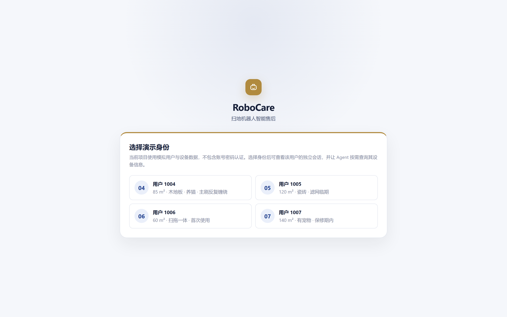
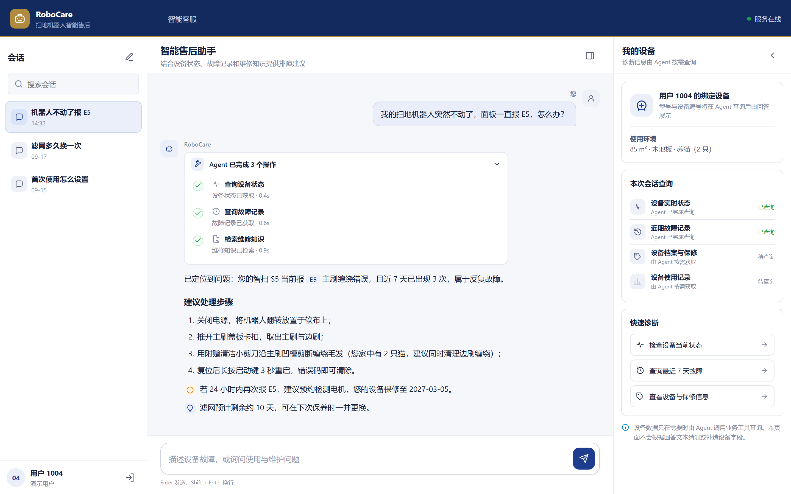
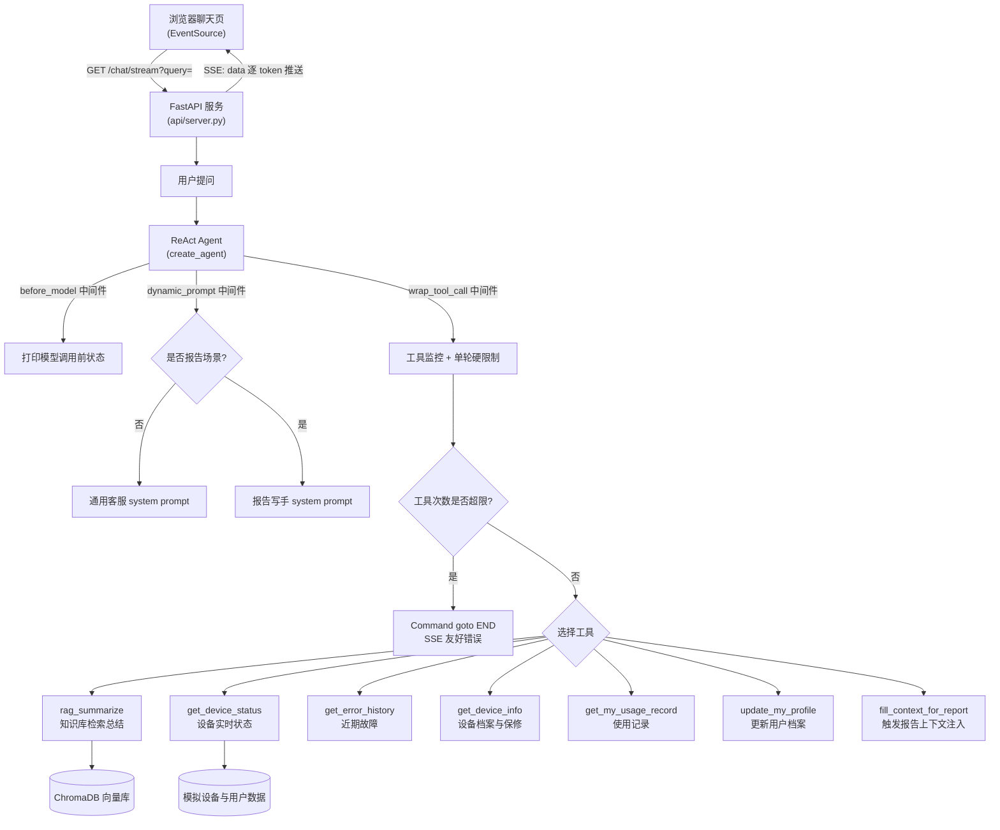

# 扫地机器人智能客服 Agent

基于 **LangChain 1.x + LangGraph** 构建的 ReAct 智能客服 Agent，面向扫地机器人 / 扫拖一体机器人场景。

它**能连到厂家后台看见用户那台机器** —— 实时状态、错误码、故障历史、耗材寿命、保修情况，
再结合这位用户的家居环境（养宠、地面材质、户型）给出**针对他这台机器**的诊断，
而不是背一遍说明书上的通用答案。

## 产品界面





> 上图中用户只说了一句「我的机器人不动了」，Agent 自主完成了：
> 查到设备**正报 E5 主刷缠绕** → 查到**近 7 天已 3 次**、判断是反复故障 →
> 检索处理方法 → 结合该用户**家里有 2 只猫**给出清理步骤 →
> 并主动提醒**滤网仅剩 10 天**、可安排保修期内上门。

## ✨ 功能特性

- **ReAct 自主推理**：模型自行判断需要哪些信息、调用哪个工具，多轮工具调用后综合设备数据与维修知识给出回答。
- **Agent 循环硬限制**：单轮最多真正执行 8 次工具调用；连续相同工具与参数超过 3 次会提前终止，并以 LangGraph `recursion_limit=24` 作为第二层保险。计数器按用户消息创建，不会被 SQLite 会话历史跨轮累计。
- **设备侧感知**：查询设备实时状态与错误码、故障历史聚合摘要、设备档案与保修状态 —— 用户报障时无需反问"请问面板显示什么"。
- **RAG 知识库**：本地知识文档经分块 + BGE向量化存入 ChromaDB，先召回Top5，再用 BGE CrossEncoder重排序并保留Top3交给模型总结。
- **多轮对话记忆**：LangGraph checkpointer 将会话状态落盘 SQLite，重启不丢；对话过长时按 token 阈值自动摘要压缩，而非简单截断。
- **动态提示词切换（AOP 思想）**：通过 LangGraph 中间件拦截，识别到「报告生成」意图时，运行时自动把 system prompt 从「通用客服」切换为「报告写手」。
- **用户档案的获取与演进**：档案区分每项信息的来源（设备自动测得 / 用户告知 / **未知**）。
  「未知」是显式状态 —— Agent 因此能意识到自己不知道，在该信息确实会改变建议时顺带询问，
  用户答复后写入档案，跨会话长期生效，无需重复告知。
- **SSE 流式输出**：FastAPI 以 Server-Sent Events 逐 token 推送，回复像 ChatGPT 一样"吐字"，首 token 即时可见。
- **智能售后工作台**：原生 HTML / CSS / JavaScript 实现会话列表、正文式 Agent 回答、可审计工具调用轨迹、快捷诊断与设备信息侧栏。
- **全链路日志**：工具调用监控、模型调用前状态记录，便于调试与观测。
- **配置与密钥分离**：模型/RAG 参数走 YAML，密钥走环境变量（`.env`），不入库。

## 🧱 技术栈

| 分类 | 选型 |
|------|------|
| Agent 框架 | LangChain 1.3 / LangGraph 1.2（`create_agent` + middleware） |
| 大模型 | 通义千问 `qwen3.8-max`（走阿里云百炼的 **OpenAI 兼容接口**，见下方说明） |
| Embedding | 本地 `BAAI/bge-small-zh-v1.5` |
| Reranker | 本地 `BAAI/bge-reranker-base`（Top5 → Top3） |
| 向量库 | ChromaDB + langchain-chroma |
| 文档加载/切分 | PyPDFLoader / TextLoader + RecursiveCharacterTextSplitter |
| 会话记忆 | LangGraph SqliteSaver checkpointer（thread_id 区分会话，落盘持久化） |
| 上下文管理 | SummarizationMiddleware（超长对话自动压缩为摘要，非简单截断） |
| Web 服务 | FastAPI + Uvicorn（SSE 流式接口） |
| 前端 | 原生 HTML / CSS / JS（EventSource 消费 SSE，零构建依赖） |
| 配置/密钥 | PyYAML + python-dotenv |

> **为什么聊天模型用 `ChatOpenAI` 而不是 `ChatTongyi`？**
> `ChatTongyi` 在 `streaming=True` 时拼接工具调用参数会产出非法 JSON，导致 DashScope 返回
> `InvalidParameter: function.arguments must be in JSON format`，流式与工具调用无法兼得。
> 改用百炼的 OpenAI 兼容端点（`/compatible-mode/v1`）后，流式与 Function Calling 均正常。

## 🗺️ 架构概览



## 📁 目录结构

```
扫地机器人客服agent/
├── api/
│   └── server.py              # FastAPI 服务：SSE 流式接口 + 托管前端页面
├── web/
│   ├── index.html             # 页面结构
│   ├── styles.css             # RoboCare 产品样式与响应式布局
│   └── app.js                 # 会话、SSE、Agent Trace 与设备面板交互
├── agent/
│   ├── react_agent.py        # Agent 组装：create_agent + 流式执行
│   ├── guard.py              # 单轮 Tool Call / 重复调用 / 图递归硬限制
│   └── tools/
│       ├── agent_tools.py     # 7 个工具的 @tool 实现
│       └── middleware.py      # 3 个中间件：工具监控 / 模型前日志 / 动态提示词
├── rag/
│   ├── vector_store.py        # 向量库服务：加载知识、检索（含 MD5 去重）
│   └── rag_service.py         # RAG 总结服务：检索 → 拼 context → 模型总结
├── model/factory.py           # 抽象工厂：生成 chat / embedding 模型
├── prompts/                   # 系统 / RAG总结 / 报告 三套提示词
├── config/                    # rag / chroma / prompts / agent 四份 YAML 配置
├── data/                      # 知识库文档 + external/records.csv（用户使用记录）
├── utils/                     # 配置加载 / 文件 / 日志 / 路径 / 提示词加载
├── chroma_db/                 # ChromaDB 持久化目录（运行生成，已 gitignore）
├── .env.example               # 环境变量模板
└── requirements.txt
```

## 🚀 快速开始

### 1. 克隆并创建虚拟环境

```bash
python -m venv .venv
# Windows
.venv\Scripts\activate
# macOS / Linux
source .venv/bin/activate
```

### 2. 安装依赖

```bash
pip install -r requirements.txt
```

### 3. 配置密钥

复制 `.env.example` 为 `.env`，填入你的 DashScope API Key：

```bash
cp .env.example .env
# 然后编辑 .env： DASHSCOPE_API_KEY=sk-你的密钥
```

> 密钥在 [阿里云百炼控制台](https://bailian.console.aliyun.com/) 获取。

### 4. 构建知识库（首次运行需要）

把知识文档放入 `data/`（支持 `.txt` / `.pdf`），然后：

```bash
python -m rag.vector_store
```

程序会分块、向量化并写入 `chroma_db/`，并用 MD5 去重，重复文件自动跳过。

### 5. 启动服务

```bash
uvicorn api.server:app --reload --port 8000
```

然后浏览器打开 **<http://127.0.0.1:8000/>** 即可开始对话，回复会逐字流式出现。

### 接口说明

| 接口 | 说明 |
|------|------|
| `GET /` | 聊天前端页面 |
| `GET /health` | 健康检查（不调用大模型） |
| `GET /chat/stream?query=&session_id=&user_id=` | SSE 流式问答，逐 token 推送 |
| `GET /docs` | FastAPI 自动生成的交互式接口文档 |

用 curl 直接测流式接口：

```bash
curl -N -G "http://127.0.0.1:8000/chat/stream" \
  --data-urlencode "query=扫地机器人主刷多久换一次" \
  --data-urlencode "session_id=demo-session" \
  --data-urlencode "user_id=1004"
```

### （可选）命令行运行 Agent

不想开浏览器时，可直接在终端跑：

```bash
python -m agent.react_agent
```

会以用户 1004（85㎡ / 2 猫 / 设备正报 E5 主刷缠绕）的身份问「我的机器人不动了」，
并打印出 Agent 的工具调用过程与流式回答。可在 `react_agent.py` 的 `__main__` 中改成其他问题或用户。

> 注意 `user_id` 是必须的：Agent 的回答依赖当前用户的档案与设备数据，不传就只能给出通用的说明书内容。

## 🐳 Docker 部署

不想手动配环境时，用 Docker 运行，宿主机无需安装 Python 与任何依赖。

### 环境要求

- [Docker Desktop](https://www.docker.com/products/docker-desktop/)（Windows / macOS 装它，Compose 已内置，无需单独安装）
- 首次安装后先启动 Docker Desktop，等状态变为 **Engine running**

```bash
docker --version
docker compose version
```

### 1. 配置密钥

```bash
cp .env.example .env
# 编辑 .env，填入 DASHSCOPE_API_KEY
```

密钥通过 `env_file` 在运行时注入容器，不会被打包进镜像。

### 2. 构建知识库（首次运行需要）

向量库是空数据卷，需要先建一次：

```bash
docker compose run --rm backend python -m rag.vector_store
```

### 3. 启动 / 停止

```bash
docker compose up -d     # 启动
docker compose down      # 停止（不会删除数据卷）
```

### 服务地址

| 地址 | 说明 |
|------|------|
| <http://localhost:8000/> | 聊天前端页面 |
| <http://localhost:8000/docs> | Swagger 交互式接口文档 |
| <http://localhost:8000/health> | 健康检查 |

```bash
docker compose ps        # STATUS 出现 (healthy) 即为正常
docker compose logs -f   # 跟踪日志
```

> 首次启动要下载嵌入模型（`HuggingFaceEmbeddings` 在模块导入时初始化），
> 可能持续几分钟，期间健康检查显示 `starting` 属正常，
> `docker-compose.yml` 里已把 `start_period` 设为 180s。

### 数据持久化

容器可随意删除重建，数据不丢，全部存在 Docker 命名卷里：

| 卷 | 容器内路径 | 存放内容 |
|------|------|------|
| `agent-state` | `/state` | `app.sqlite`（会话历史 + LangGraph checkpoint + 用户档案）、`chroma_db/`（向量库）、`md5.text`（增量索引去重记录） |
| `model-cache` | `/home/app/.cache` | 嵌入与重排序模型缓存，避免每次重建都重新下载 |

验证：随便聊几句后执行

```bash
docker compose down
docker compose up -d
```

刷新页面，之前的会话仍在。彻底清空数据（含向量库）：

```bash
docker compose down -v
```

### 项目结构说明

```
├── Dockerfile              # 镜像构建：依赖层 / 代码层分离，利用构建缓存
├── docker-compose.yml      # 编排：端口、环境变量、数据卷、健康检查
├── .dockerignore           # 构建时排除 .venv / .env / 数据库等
├── docker/entrypoint.sh    # 容器入口：软链运行时状态到数据卷，再启动 uvicorn
├── api/server.py           # FastAPI 入口（uvicorn api.server:app）
└── web/                    # 前端页面，由 FastAPI 直接提供，不单独部署
```

Docker 里只有一个 `backend` 服务，它同时提供后端接口与前端页面（`GET /` 返回 `web/index.html`）。

> **为什么需要 entrypoint.sh**：代码里的路径固定在项目根目录（`app.sqlite`、`chroma_db/`、`md5.text`），
> 而 Docker 数据卷无法直接挂到"文件路径"上（会被建成目录，SQLite 将无法打开）。
> 入口脚本把这三项软链到数据卷 `/state`，因此**不需要改动任何业务代码**。

## 🔧 内置工具

| 工具 | 说明 |
|------|------|
| `rag_summarize` | 从知识库检索专业资料并总结 |
| `get_device_status` | 查设备实时状态：在线 / 电量 / 当前任务 / 当前错误码 |
| `get_error_history` | 查近 N 天故障的**聚合摘要**（类型、次数、最近一次） |
| `get_device_info` | 查设备档案：型号 / 购买日期 / 保修状态与剩余天数 |
| `get_my_usage_record` | 查某月使用记录（月份可选，默认最近一个月） |
| `update_my_profile` | 记录用户主动告知的家居环境信息（写操作，档案随服务过程逐步完善） |
| `fill_context_for_report` | 触发报告场景上下文注入，配合动态提示词切换 |

> **所有工具都不接受 `user_id` 参数** —— 身份由 API 层从登录态注入运行时上下文，
> 模型无权指定查谁的数据，从结构上杜绝越权读取他人数据。
> 面向模型的查询一律返回**聚合摘要**而非原始明细，避免真实数据量下撑爆上下文。

## ⚠️ 已知限制与边界说明

- **数据源为模拟**：`data/external/` 下的 CSV 模拟厂家侧的用户资料、设备档案、实时状态与故障日志。
  真实部署时替换为账号系统与设备遥测 API —— **改动仅限 `store/` 一层，Agent、工具、提示词均无需改动**。
- **⚠️ 不做身份认证，接口未鉴权（仅供本地演示，切勿直接公网部署）**
  `user_id` 由前端作为查询参数传入，服务端不做校验 —— 也就是说，
  **任何人改一下 URL 参数就能以任意用户身份提问、读取其会话与设备数据**：
  ```bash
  curl "http://127.0.0.1:8000/sessions?user_id=1005"   # 直接读到 1005 的会话
  ```
  这是有意为之的简化：真正的认证需要密码 / 短信 / OAuth，属于独立的安全议题，
  与 Agent 能力正交。**若只发一个 token 而登录环节不验证身份，等于安全表演**
  —— 谁都能拿到任意用户的 token，复杂度上去了、安全性没变，反而更具误导性。

  接入真实认证时，只需让 `user_id` 改为从鉴权后的会话中获取，
  Agent 与工具层无需改动（工具签名本就不接受 `user_id`，见下方工具说明）。

  > 需要区分两层越权：
  > - **模型侧**（已防护）：工具签名不暴露 `user_id`，模型无法指定查谁的数据；
  > - **接口侧**（未防护）：客户端可自称任意身份 —— 这正是上面说的简化。
- `store/` 现为 CSV 全量载入内存，仅适用于演示规模；真实数据量下需改为按需查询 API。

## 📊 检索效果评测

项目内置了独立的检索评测，不调用聊天模型，也不评价 ReAct 工具选择或最终答案。评测集包含 50 条人工设计并标注的问题，覆盖故障排查、维护保养、选购建议、使用设置和扫拖功能。

每个相关文本块使用 `(source_name, chunk_index)` 标注，运行前会校验标签是否仍存在于当前 Chroma 索引。默认同时计算 Top1、当前生产配置 Top3 和 Top5 的 Precision、Recall、HitRate、MRR、NDCG，以及平均/P95检索延迟。

```bash
python -m evaluation.run_retrieval_eval
```

完整说明见 [`evaluation/README.md`](evaluation/README.md)，运行结果写入 `evaluation/results/<时间戳>/`。

同一套50题的向量基线与重排序结果：

| 链路 | Recall@3 | HitRate@3 | MRR@3 | NDCG@3 | 平均延迟 | P95延迟 |
|---|---:|---:|---:|---:|---:|---:|
| Chroma直接Top3 | 0.730 | 0.920 | 0.757 | 0.680 | 13.1ms | 14.6ms |
| Chroma Top5 → BGE Rerank → Top3 | 0.820 | 0.940 | 0.870 | 0.811 | 602.8ms | 668.6ms |

重排序后所有预设Top3指标均通过，证明原问题主要是候选排序而不是向量召回；代价是CPU检索增加约0.59秒延迟。Reranker采用延迟加载，并在生产调用失败时回退到原始向量排序。

## ✅ 自动化测试

```bash
python -m pytest -q
```

当前覆盖检索指标、模拟业务时间、Agent 工具硬限制、重复调用拦截、LangGraph 递归异常转换与 SSE 正常结束，共 **25 项测试**。

## 🛣️ Roadmap

- [x] FastAPI + SSE 流式接口，前后端分离
- [x] 多轮对话记忆（LangGraph checkpointer + thread_id，落 SQLite 持久化）
- [x] 多用户身份与会话管理（每个用户独立的会话列表）
- [x] 前端以公开工具事实展示 Agent 执行轨迹，不暴露模型私有思维链
- [x] 单轮 Tool Call 硬限制 + 重复调用保护 + LangGraph recursion limit
- [x] RAG 检索效果评测集（人工标注，Top1 / Top3 / Top5）
- [x] 根据评测接入本地 BGE Rerank（Top5 → Top3）并验证收益与延迟
- [x] Docker 一键部署（镜像分层缓存 + 数据卷持久化 + 健康检查）
